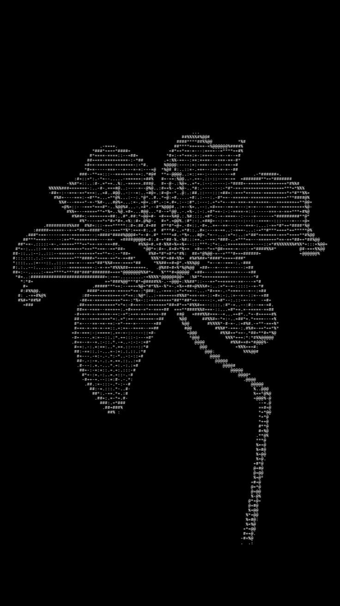
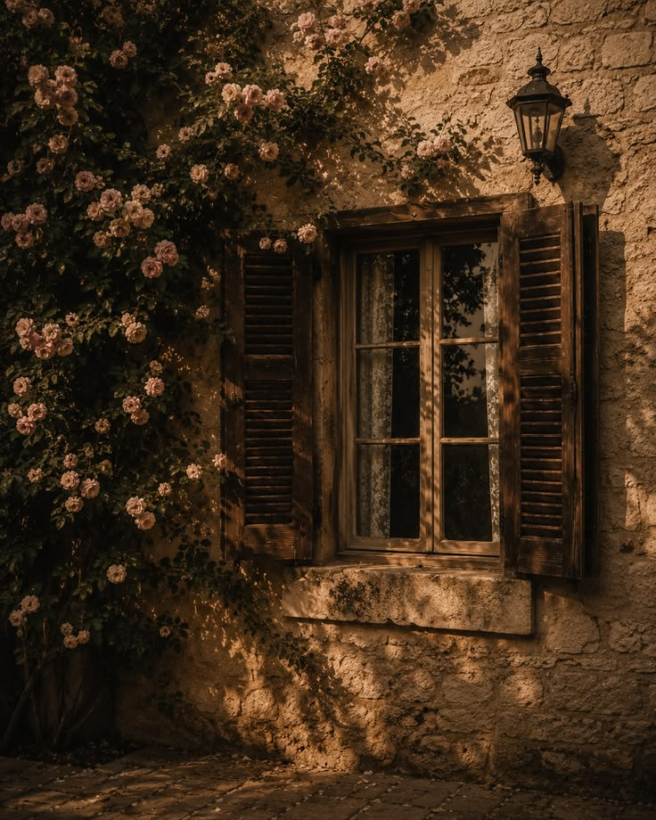
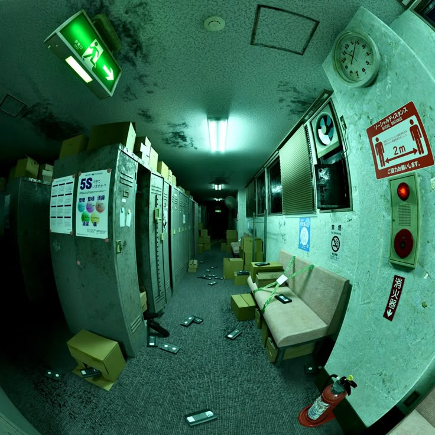
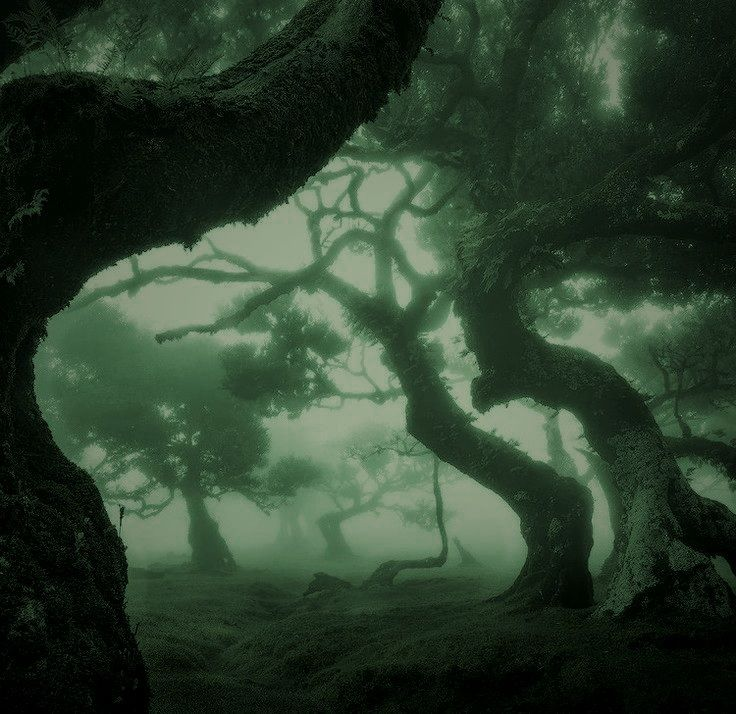
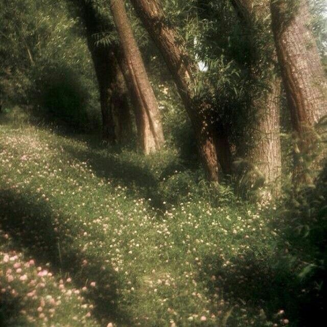
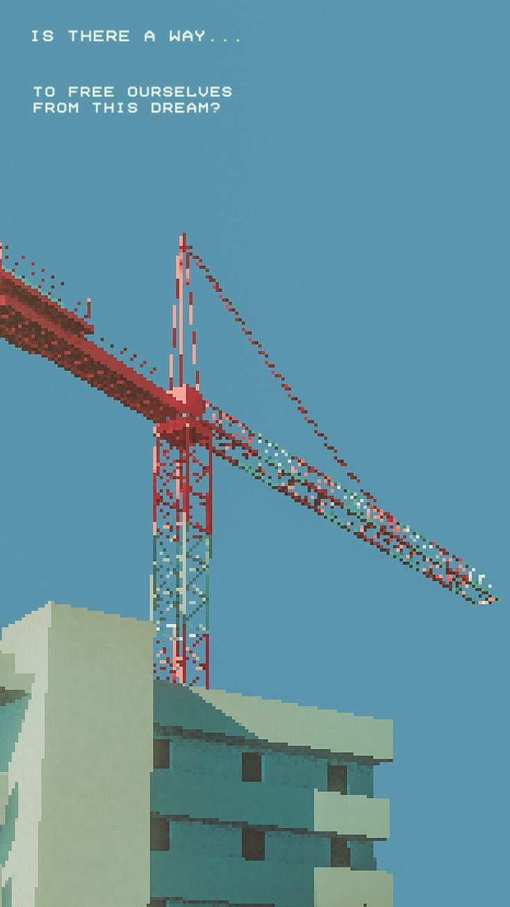

<div align="center">
  
  <h1>RetroCam</h1>
  <p><b>41 real-time retro filters for Android, every pixel computed by a GLSL fragment shader.</b><br>
  Not a static overlay — the whole frame is resampled, quantised and re-coloured on the GPU at preview framerate.</p>

  <p>
    
    
    
    
    
    
    
  </p>
</div>

---

## What it is

A camera app whose reason to exist is the filter engine. Frames come out of CameraX, get uploaded to an offscreen `EGL10` context, run through a per-filter fragment shader, and are composited into the viewfinder — so what you see is the actual output, at your actual resolution, including for distortion filters that warp the whole frame.

Filters are **data, not code**. Each one is a GLSL body plus a catalog entry. Adding a filter touches no renderer code — see [Adding a filter](#adding-a-filter).

## Filter stills

The visual targets the shaders were tuned against:

<table>
<tr>
  <td align="center"><br><sub><b>ASCII</b></sub></td>
  <td align="center"><br><sub><b>VINTAGE</b></sub></td>
  <td align="center"><br><sub><b>FISHEYE</b></sub></td>
</tr>
<tr>
  <td align="center"><br><sub><b>GLOOMY</b></sub></td>
  <td align="center"><br><sub><b>SOFT</b></sub></td>
  <td align="center"><br><sub><b>8 BIT</b></sub></td>
</tr>
</table>

## Features

**Camera**

- Front and back cameras, instant flip
- Selfie mirroring and display rotation
- Torch, plus a **−6…+6 EV** exposure dial mapped proportionally onto each camera's real hardware range (so the slider feels the same on both lenses)
- Aspect ratio: `1:1` · `4:3` · `16:9`
- Composition grid and self-timer

**Filters**

- **41 filters** across 5 families
- Per-filter **intensity** and **size** (effect scale) sliders
- Favourites — long-press a filter to pin it to ★
- **Search by name *or* by look**: type `old film` and VINTAGE comes up, `bone` finds XRAY, `camcorder` finds VHS. Matching is per-token AND, and `x-ray` / `x ray` / `xray` are equivalent
- Live thumbnail strip of every filter, rendered on-device

**Capture and output**

- Stills as **JPEG or PNG**
- Video to **MP4** — a `MediaRecorder` fed by the renderer's EGL surface, H.264 at 30 fps / 10 Mbps, up to 1920 px on the long edge, with optional AAC microphone audio. The file is inserted into MediaStore as `IS_PENDING` and only published once the encoder stops, so a failed take never leaves a zero-byte video behind
- **Custom save folder** — pick any folder with the system picker; the chosen tree is mapped onto MediaStore's `RELATIVE_PATH`
- Photo cards: the shot centre-cropped into a rounded window on a paper card, with a caption bar beneath it (header, title, details), drawn via `android.graphics`
- Gallery that reads the configured save folder back out of MediaStore

**Interface**

- shadcn-style design system: Radix `neutral` token set, 8px radius scale, platform UI/mono type roles, Radix motion timings
- Micro-interactions throughout, with a full **reduced motion** respect path
- In-app **diagnostics** readout: texture-grab ms and frame ms

## The 41 filters

| Family | Filters |
|---|---|
| **DITHER** (11) | Original · DITHER · INK · GRAY · ASCII · PIXEL · BAYER · PIXEL ART · EGA · ATKINSON · ORDERED |
| **STYLIZE** (15) | COLOR · POSTER · EDGE · EMBOSS · THERMAL · XRAY · HEATMAP · SKETCH · ANIME · TRAILS · XHATCH · STAINED · SOFT · GLOOMY · VINTAGE |
| **HARDWARE** (7) | 8 BIT · GAMEBOY · CRT · VHS · C64 · ZX · NIGHT |
| **PRINT** (5) | HALFTONE · CYANO · NEWS · BLUEPRT · ENGRAVE |
| **DISTORT** (3) | SWIRL · FISHEYE · KALEIDO |

`Original` is a true pass-through. `TRAILS` is the only temporally-dependent filter — it needs the previous frame, so it runs through the renderer's FBO ping-pong path.

## Architecture

| Module | What it owns |
|---|---|
| `catalog` | `FilterSpec` entries, all GLSL bodies in `Shaders.kt`, and `FilterSpec.matches()` for search. **Pure JVM, no Android deps** — the shaders can be compiled and validated on a desktop JVM. |
| `renderer` | `FilterRenderer`: `EGL10` offscreen context, program cache, `renderChain`, the fullscreen quad, the glyph ramp for ASCII, and the video encoder bridge. |
| `camera` | CameraX controller — binding, front/back, torch, exposure range, rotation. |
| `core/datastore` | `SettingsRepository`, every persisted key. |
| `core/designsystem` | `RetroCamTheme`, the shadcn token set (`Tokens.kt`), the component set (`components/`) and motion tokens. |
| `app` | Compose camera UI, filter drawer, settings, gallery, photo cards. |

### How a filter works

Every filter is a GLSL body defining one function:

```glsl
vec4 applyFilter(vec4 src, vec2 uv)
```

wrapped by the shared `Shaders.HEADER` (which supplies the source sampler, `u_param1..3`, `u_resolution`, `u_theme`, `u_intensity`, and helpers like `sampleSrc`, `sampleBlock`, `luminance`, `bayer4`, `hash12`, `posterizeR`) and `Shaders.FOOTER`.

`FilterSpec` carries the id, display name, family, search `context`, the body, up to three knobs, an optional palette, the default intensity, and whether it is `temporal`. The renderer compiles a program per spec and never inspects what a filter does.

### Adding a filter

1. Add a `const val` GLSL body to `catalog/…/Shaders.kt`.
2. Add one `FilterSpec(...)` entry to `FilterCatalog.all` — including a `context` string, so it stays findable by search.
3. That's it. No renderer changes, no new classes.

## Building

Requirements: **JDK 17**, **Android SDK 35**, and either the bundled Gradle wrapper or a local Gradle 8.9.

```bash
git clone https://github.com/luminexofc/RetroCam.git
cd RetroCam

echo "sdk.dir=/path/to/Android/sdk" > local.properties   # or set ANDROID_HOME

./gradlew assembleDebug
```

Output: `app/build/outputs/apk/debug/app-debug.apk`

A debug build is unsigned-by-Gradle for release purposes but installable with `adb install`, or by copying it to the device and tapping it (you'll need "install from unknown sources" enabled).

## Project layout

```
RetroCam/
├── app/                     Compose UI, settings, gallery
├── camera/                  CameraX controller
├── catalog/                 FilterSpec catalog + all GLSL (pure JVM)
├── renderer/                EGL/GL engine, program cache, video encoder
├── core/
│   ├── datastore/            SettingsRepository
│   └── designsystem/        Theme + motion tokens
├── Docs/                    Design specs
├── Media/                   Filter reference stills + icon source
└── gradle/libs.versions.toml
```

## Notes and limitations

- **Search is substring, not fuzzy.** `vintag` or `vnintage` won't find VINTAGE. Edit distance was skipped deliberately — it needs per-filter thresholds and hasn't been worth it yet.
- **No video effects beyond the 41 filters** — no crossfades, transitions or multi-filter chains.
- The renderer still contains a dormant multi-pass composer (`ChainLink` / `renderChain`) that nothing currently drives. It is left in place rather than ripped out.
- `RECORD_AUDIO` is requested at runtime only because video mode offers mic audio; stills never need it.

## Docs

`Docs/` holds the specs the implementation was built against:

| File | Contents |
|---|---|
| `PRD.md` | Product requirements |
| `Architecture.md` | Module layout and design decisions |
| `Filters.md` | The filter engine and how filters are defined |
| `Design.md` | UI/UX |
| `Animations.md` | Motion and micro-interactions |
| `Tech_stack.md` | Technology choices |
| `Phase.md` | Build phases |

## License

No license file yet. The bundled fonts are SIL OFL 1.1; the application code is unlicensed until you add one.
